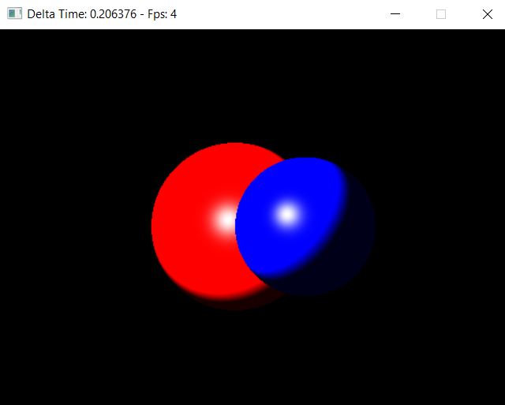
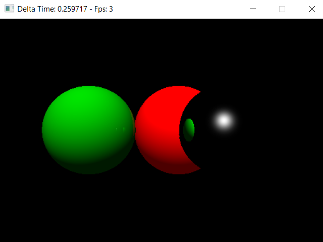

# SW Raytracer C
A software raytracer engine written in  C. 
The objective is rendering a 3D scene with raytracing algorithm running on CPU implementing:
* Material concept for the objects
* Lightings (directional and point light)
* Phong effect
* Reflections

# Rendering samples
Example with Phong effect on opaque objects with a Point Light.

---

Example with Phong effect on opaques and reflectives objects with a Directional Light.

# Development
* C11 Standards
* Software managed with [CMake](https://cmake.org/)
* Window management with [SDL2](https://www.libsdl.org/)
